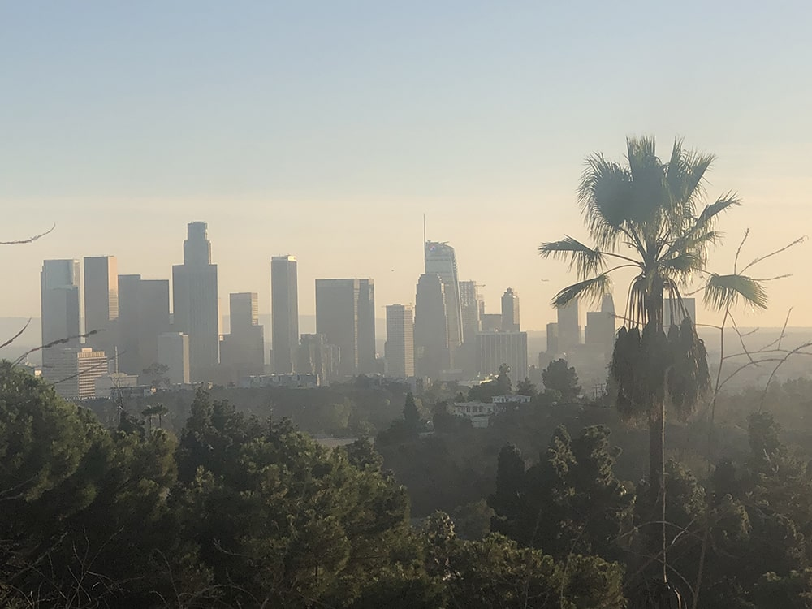
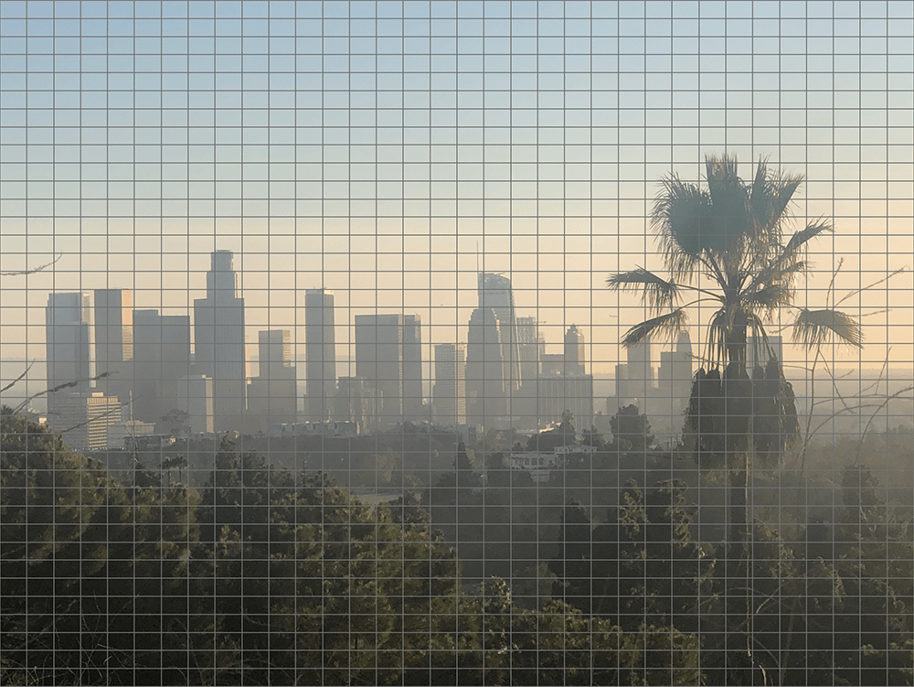
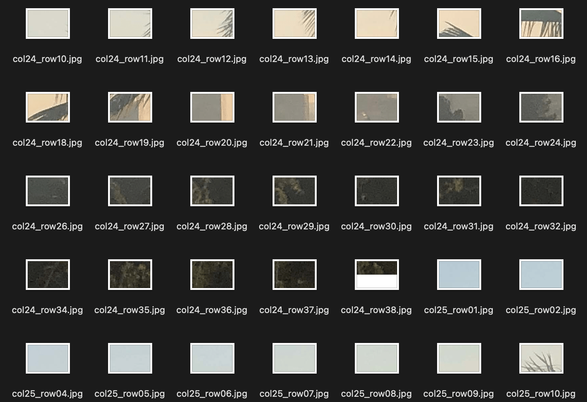
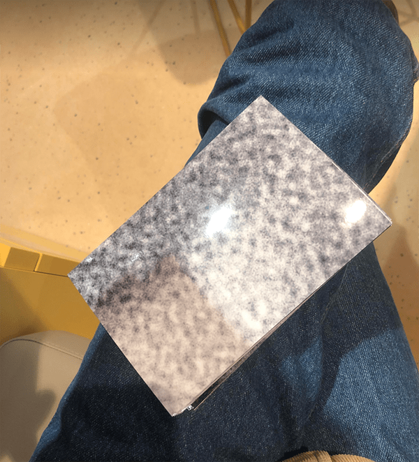

# Easy Mosaic Tiler for Photoshop

Photoshop script allowing you to create wall mosaics from a single image. It automatically divides your image into 6x4" tiles, which you can easily print at a pharmacy photo kiosk.

The script will:

1. Ask you to provide the dimensions of the wall area you want to cover with the mosaic.
2. Contain your image within the wall area while maintaining its aspect ratio.
3. Divide the image into 6x4 inch tiles and save them as separate JPEG files.

## Getting Started

### Installation

1. Download the `CreateMosaicTiles.jsx` file from the repository.
2. Open Adobe Photoshop.

### Usage

1. Open the image you want to create a mosaic from in Photoshop.
2. Go to `File` > `Scripts` > `Browse...` and locate the downloaded `mosaic_tiler.jsx` file.
3. The script will prompt you to enter the width and height of the wall (in inches) you want to create a mosaic for.
4. Select a folder where you want to save the 6x4 inch tile JPEG files.
5. The script will generate the tiles and save them in the selected folder.

Now, take the exported JPEG files to your nearest pharmacy or drugstore photo kiosk and print your 6x4 inch tiles. Assemble the printed tiles on your wall to create the mosaic!

## Example Images

Original image:

Grid divisions:

Exported tiles:

Printed photos:

## License

[MIT](https://choosealicense.com/licenses/mit/)
